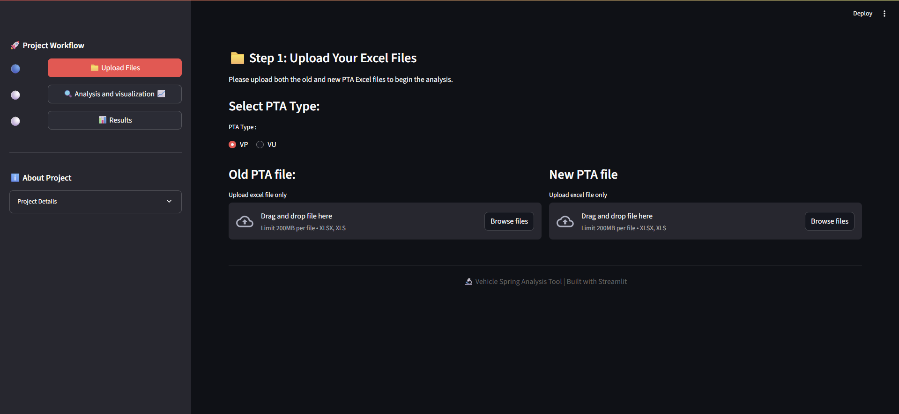
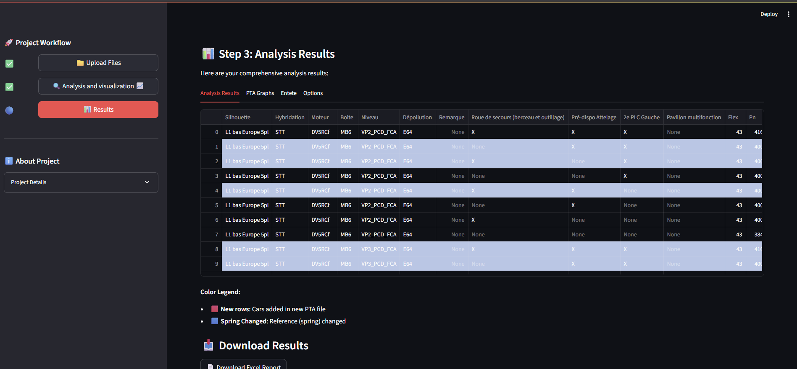

# Spring Change Detection

## Application Workflow

### 1. Upload PTA Files

Upload the old and new PTA Excel files for comparison.

### 2. Data Analysis & Visualization

The application performs statistical analysis and visualizes key metrics.

### 3. Results Dashboard

View detected spring changes, highlighted new cars, and download results.

## Video Guid

Watch the introductory video for a quick overview of the application:
<video src="video/intro.mp4" controls width="600"></video>

## Goal

the goal of this project is to compare two PTA excel files (old, new) to detect vehicle spring changes
based on reference column

we have two main types of pta files

- VU
- PU

first the user need to choose between the two {VU, PU},then the user need to upload both new and old pta file successfully

Before any preprocessing steps we will merge the two pta file after converting them into dataframes, based on the id_columns, the id_columns are the columns that identify the id of any cars in the dataframe and based on them be will compare between the cars an the old and the new pta files, so the results are the following

- Displaying both the old and new pta file
- statistical analysis: Display key metrics and summary statistics
- Data Visualization
- Change Detection (Spring changes or not) based on the reference column
- highlight the new cars
- Results Dashboard
- Download the results in a well formatted excel file

## libraries

we use the following libraries:

- pandas : for data preprocessing and excel handling
- streamlit : making easy to create and deploy a custome web application specially for machine learning and data science application
- streamlit-lottie: for adding some animations.
- plotly: for data visualization